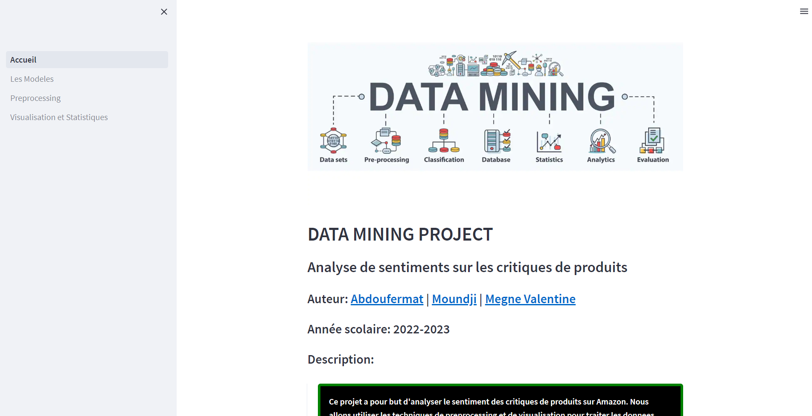
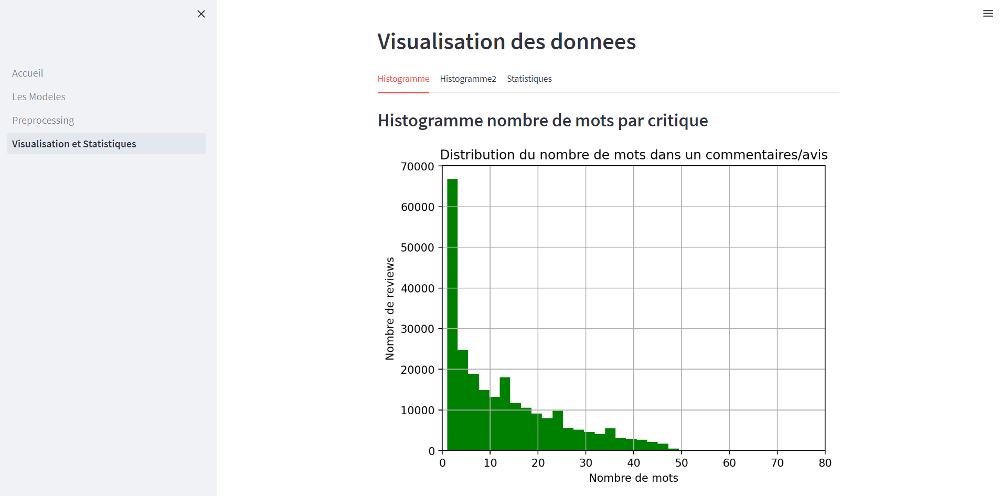
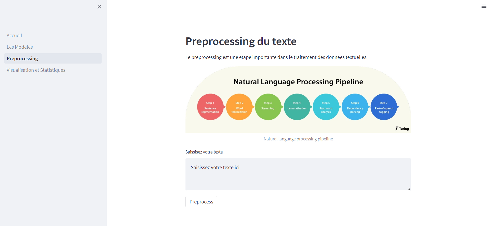
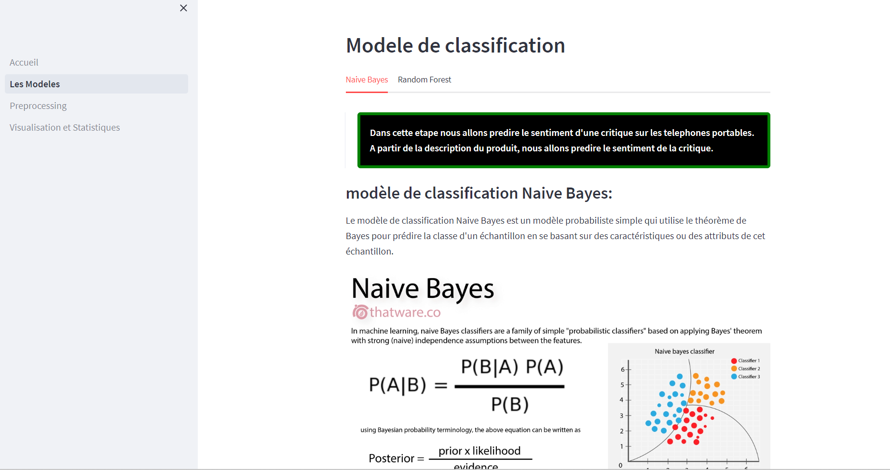
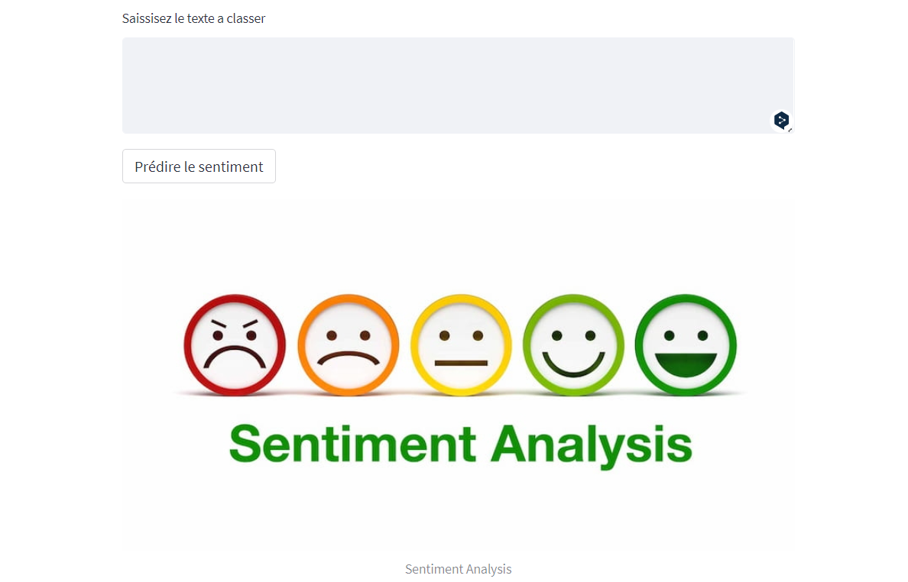

# Unlocked Phone Reviews amazon

## clone this repo

```bash git clone url ```

## install dependencies

```bash pip install -r requirements.txt ```

## download the dataset from kaggle

> [https://www.kaggle.com/datasets/PromptCloudHQ/amazon-reviews-unlocked-mobile-phones](https://www.kaggle.com/datasets/PromptCloudHQ/amazon-reviews-unlocked-mobile-phones)

Then move the csv file to the **data/** folder

## notebooks

>- notebooks/stats_on_other_features.ipynb
> > here we explore the other features of the dataset
> 
>- notebooks/preprocessing.ipynb
> >here we preprocess the data
> 
>- notebooks/model.ipynb
> > here we build different models and compare them

## streamlit app

We've built a streamlit app to make it easier to understand the data and the models



To run the app

> go to the deploy folder
> ```bash cd deploy ```
> 
> install local package fermat-helpers
> ```bash pip install . ```
> 
> run the app
> ```bash streamlit run Accueil.py ```
> 
> go to the url displayed in the terminal
> [http://localhost:8501](http://localhost:8501)


## Some screenshots of the app

- Visualisation of the data and Stats



- Preprocessing page



- Exploring the models



- Predictions

